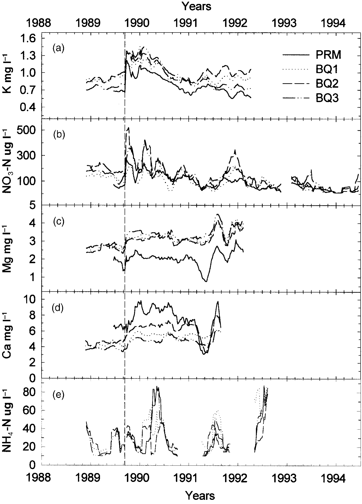

# Hurricane Hugo (1989) impact on Puerto Rico's Water Quality

## Background
After Hurricane Hugo made impact on Puerto Rico in 1989, Schaefer et al. ([2000](https://doi.org/10.1017/s0266467400001358)) studied the long-term stream water quality in Bisley, Puerto Rico.

This project aims to replicate Figure 3 from Schaefer et al. ([2000](https://doi.org/10.1017/s0266467400001358)). We focused on potassium, nitrate, magnesium, calcium, and ammonium at four sites. The four sites are Puente Roto Mameyes (PRM), Quebrada one-Bisley (BQ1), Quebrada two-Bisley (BQ2), and Quebrada three-Bisley (BQ3).

{fig-align="center"}

_Concentration of (a) potassium, (b) nitrate, (c) magnesium, (d) calcium, and (e) ammonium sampled in Bisley, Puerto Rico after Hurricane Hugo._


## Data
Data is accessed through the [Environmental Data Initiative](https://portal.edirepository.org/nis/mapbrowse?packageid=knb-lter-luq.20.4923064), by International Institute of Tropical Forestry (IITF), USDA Forest Service.  
We isolated the Site ID, Sample Date, and the concentration of potassium, nitrate, magnesium, calcium, and ammonium from PRM, BQ1, BQ2, and BQ3.
```{r, output = FALSE, echo = FALSE}
library(tidyverse)
df <- read_csv("../output/allsite_mvavg.csv")
```

## Methods
The watersheds in this study were all located in the Rio Mameyes drainage basin within Luquillo Experimental Forest (LEF) in northeastern Puerto Rico.  
From the EDI database, we downloaded the dataset for Puente Royo Mameyes and Bisley Quebrada 1, 2, and 3.
When reading in the data, we defined a function that calculated the ion concentration level for a 9-week moving average by site for potassium, calcium, magnesium, ammonium, and nitrate.  

## Results
Following the full dataset from EDI that spans from 1986 to 2020.
```{r}
#| warning: false
#| echo: false
#| fig-width: 7
#| fig-height: 8
ggplot(
  data = df,
  mapping = aes(
    x = window_start,
    y = concentration,
    color = site
  )
) +
  geom_line() +
  labs(
    title = "Moving Average of Ions in Stream Water in Bisley, Puerto Rico",
    x = "Years"
  ) +
  facet_wrap(
    ~ions,
    scales = "free",
    ncol = 1,
    strip.position = "left",
    labeller = as_labeller(c(k_mgl="K mg l^-1",
                            ca_mgl="Ca mg l^-1",
                            mg_mgl="Mg mg l^-1",
                            nh4_ugl="NH4-N ug l^-1",
                            no3_ugl="NO3-N ug l^-1"))
  ) +
  theme_bw() +
  geom_vline(xintercept = ym("1989-09"), linetype = "dashed")
```
Then, to replicate the figure from Schaefer et al.'s paper, the data is concentrated to 1988 to 1994.
```{r}
#| warning: false
#| echo: false
#| fig-width: 7
#| fig-height: 8
ggplot(
  data = df,
  mapping = aes(
    x = window_start,
    y = concentration,
    color = site
  )
) +
  geom_line() +
  labs(
    title = "Moving Average of Ions in Stream Water in Bisley, Puerto Rico from 1988 to 1994",
    x = "Years"
  ) +
  facet_wrap(
    ~ions,
    scales = "free",
    ncol = 1,
    strip.position = "left",
    labeller = as_labeller(c(k_mgl="K mg l^-1",
                            ca_mgl="Ca mg l^-1",
                            mg_mgl="Mg mg l^-1",
                            nh4_ugl="NH4-N ug l^-1",
                            no3_ugl="NO3-N ug l^-1"))
  ) +
  theme_bw() +
  geom_vline(xintercept = ymd("1989-09-18"), linetype = "dashed") +
  xlim(ym("1988-01"), ym("1994-06"))
```
### References
- McDowell, William H., and USDA Forest Service. International Institute Of Tropical Forestry (IITF). 2024. “Chemistry of Stream Water from the Luquillo Mountains.” Environmental Data Initiative. [doi.org/10.6073/PASTA/F31349BEBDC304F758718F4798D25458.](https://doi.org/10.6073/PASTA/F31349BEBDC304F758718F4798D25458)
- Schaefer, Douglas. A., William H. McDowell, Fredrick N Scatena, and Clyde E. Asbury. 2000. “Effects of Hurricane Disturbance on Stream Water Concentrations and Fluxes in Eight Tropical Forest Watersheds of the Luquillo Experimental Forest, Puerto Rico.” Journal of Tropical Ecology 16 (2): 189–207. [doi.org/10.1017/s0266467400001358.](https://doi.org/10.1017/s0266467400001358)